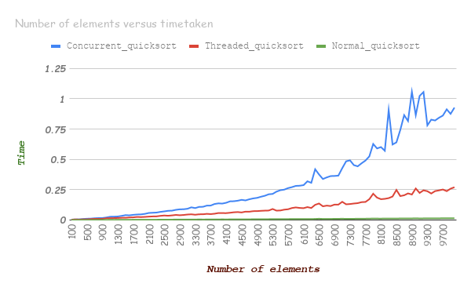

# Concurrent Quicksort

Implemented a variation of Concurrent version Quicksort algorithm which uses threads and processes and compared their time with normal implementation of Quicksort.

### Implementation
The algorithm first picks an element called a pivot (takes the median of three random numbers to avoid worst case complexity of O(n^2)). Then partition the array around this pivot. The function is then recursively applied to the left and right subarrays in child of parent process (in case of concurrent quicksort) and in different threads in case of threaded quicksort.

### Tests
We have generated random test cases for n from 1 to 10000 and plotted a graph for time taken by each of normal, concurrent and threaded quicksort.

#### Results
All times reported are an average of three tests each, in seconds

### General Observation:
The normal quick sort ran the fastest, while the concurrent quick sort based on
processes ran the slowest.

The process based program ran the slowest because of

 1. Constant context switches
 2. Generating new processes is a time consuming task

